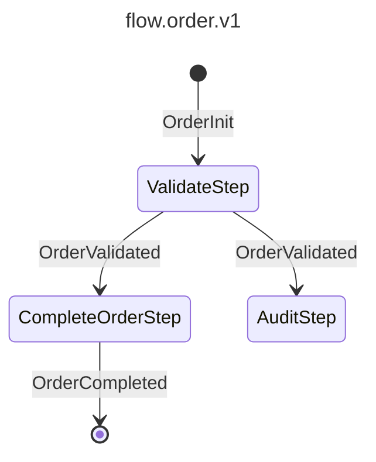

# flowcrafter

[](https://github.com/wundii/flowcrafter/actions/workflows/code_quality.yml)
[](https://phpstan.org/)

[](https://www.php.net/)
[](https://getrector.com)
[](https://tomasvotruba.com/blog/zen-config-in-ecs)
[](https://phpunit.org)
[](https://codecov.io/github/wundii/flowcrafter)
[](https://packagist.org/packages/wundii/flowcrafter)

> **PHP-Engine für message-driven Workflows** — Geschäftsprozesse als typsichere State Machines in reinem PHP, mit synchroner, asynchroner und zeitgesteuerter Ausführung und lückenlosem Audit-Log.

Ein Workflow besteht aus typisierten **Messages**, die zwischen **Steps** fließen.
Das Routing schreibt man nicht — es ergibt sich aus den Constructor-Signaturen
der Steps: Welche Message ein Step im Constructor verlangt, bestimmt, wann er
läuft. Daraus entsteht ein typsicherer DAG, der sich versionieren, ausführen
und in Echtzeit überwachen lässt. Kein YAML, kein XML, keine Annotations.

## Features

  - **Schema-as-Code** — Workflows als PHP-Klassen, Routing direkt aus den Step-Constructors abgeleitet
- **Drei Ausführungsmodi** — synchron (`FlowRunner`), asynchron über Queue (`FlowObserver`) und zeitgesteuert per Cron (`FlowScheduler`)
- **Read-Model-Projektionen** — Handler reagieren asynchron auf einzelne Messages (`ProjectionWorker`)
- **Pluggable Storage** — MySQL, Redis, EventSourcingDB; eigene Backends via `StorageInterface`
- **Lückenloses Audit-Log** — jede Message, Exception und Statusänderung wird erfasst, Schemas via Hash versioniert
- **Automatischer Retry** — pro Step konfigurierbare Wiederholungen bei transienten Fehlern
- **Observability** — REST-API, Prometheus/OpenMetrics-Endpunkt und optionales [Web-UI](#web-ui)
- **Developer Experience** — Console Commands, storageless Testing, Mermaid-Diagramme und [Claude-Code-Plugin](#claude-code-plugin)

## Installation

```bash
composer require wundii/flowcrafter
```

## Quickstart

```bash
vendor/bin/flowcrafter config:create   # 1. flowcrafter.php anlegen
vendor/bin/flowcrafter storage:init    # 2. Storage initialisieren
vendor/bin/flowcrafter dev             # 3. Dev-Server starten (API + Observer + Scheduler + Projection-Worker)
```

Schritt für Schritt: [docs/getting-started.md](docs/getting-started.md).

## Beispiel

Ein vollständiger Order-Flow in drei Bausteinen — Messages, Steps, Flow.

### 1. Messages

`readonly` Value-Objects. Drei Typen steuern das Routing: `Init` startet den
Flow, `Data` fließt zwischen Steps, `Return` beendet ihn.

```php
use Wundii\Flowcrafter\AbstractMessage;
use Wundii\Flowcrafter\Interface\MessageDataInterface;
use Wundii\Flowcrafter\Interface\MessageInitInterface;
use Wundii\Flowcrafter\Interface\MessageReturnInterface;

readonly class OrderInit extends AbstractMessage implements MessageInitInterface
{
    public function __construct(private string $sku) {}
    public function getSku(): string { return $this->sku; }
}

readonly class OrderValidated extends AbstractMessage implements MessageDataInterface
{
    public function __construct(private string $sku, private int $quantity) {}
    public function getSku(): string { return $this->sku; }
    public function getQuantity(): int { return $this->quantity; }
}

readonly class OrderCompleted extends AbstractMessage implements MessageReturnInterface
{
    public function __construct(private string $summary) {}
    public function getSummary(): string { return $this->summary; }
}
```

> Braucht der erste Step keinen externen Input, gibt es die mitgelieferte
> `Wundii\Flowcrafter\EmptyInitMessage` statt einer eigenen Init-Klasse.

### 2. Steps

Reine PHP-Klassen. Der Constructor-Typ entscheidet das Routing, der Rückgabetyp
den weiteren Verlauf: `MessageData` (Flow läuft weiter), `MessageReturn` (Flow
endet) oder `bool` (Leaf-Result, kein Weiterleiten).

```php
use Wundii\Flowcrafter\Interface\MessageDataInterface;
use Wundii\Flowcrafter\Interface\MessageReturnInterface;
use Wundii\Flowcrafter\Interface\StepInterface;

class ValidateStep implements StepInterface          // Init → Data
{
    public function __construct(private readonly OrderInit $init) {}

    /** @return class-string[] */
    public function returnTypes(): array { return [OrderValidated::class]; }

    public function process(): MessageDataInterface
    {
        return new OrderValidated($this->init->getSku(), quantity: 1);
    }
}

class CompleteOrderStep implements StepInterface     // Data → Return (beendet den Flow)
{
    public function __construct(private readonly OrderValidated $validated) {}

    /** @return class-string[] */
    public function returnTypes(): array { return [OrderCompleted::class]; }

    public function process(): MessageReturnInterface
    {
        return new OrderCompleted(sprintf(
            'Order %s x%d completed',
            $this->validated->getSku(),
            $this->validated->getQuantity(),
        ));
    }
}

class AuditStep implements StepInterface             // Data → bool (FlowResult)
{
    public function __construct(private readonly OrderValidated $validated) {}

    /** @return class-string[] */
    public function returnTypes(): array { return []; }

    public function process(): bool
    {
        return $this->validated->getQuantity() > 0;
    }
}
```

### 3. Flow

Das Schema entsteht via `FlowBuilder`. Hier konsumieren `CompleteOrderStep` und
`AuditStep` dieselbe `OrderValidated`-Message — also laufen sie parallel.

```php
use Wundii\Flowcrafter\Attribute\FlowGroup;
use Wundii\Flowcrafter\FlowBuilder;
use Wundii\Flowcrafter\FlowSchema;
use Wundii\Flowcrafter\Interface\FlowInterface;

#[FlowGroup('Order Management')]   // optionale UI-Gruppierung, ohne Einfluss auf den Schema-Hash
class OrderFlow implements FlowInterface
{
    public static function schema(): FlowSchema
    {
        $builder = new FlowBuilder('flow.order.v1', OrderInit::class, OrderCompleted::class);
        $builder->addStep(ValidateStep::class);
        $builder->addStep(CompleteOrderStep::class, retries: 3, delay: 500);
        $builder->addStep(AuditStep::class);
        return $builder->build();
    }
}
```

Das passende Diagramm liefert `vendor/bin/flowcrafter diagram:mermaid App\\OrderFlow`:



## Flows auslösen

**Synchron** — direkter Aufruf, Ergebnis sofort verfügbar:

```php
use Wundii\Flowcrafter\FlowRunner;

$flowRunner = new FlowRunner(
    type: 'flow.order.v1',
    flowSource: OrderFlow::class,
    flowSubject: 'sku-42',   // optionaler Geschäfts-Key zur späteren Suche
    storage: $storage,       // aus $flowcrafterConfig->getStorage()
);

$result = $flowRunner->run(new OrderInit('sku-42'));   // MessageReturnInterface|bool
```

**Asynchron** — Message in die Queue legen, ein `FlowObserver`-Worker führt sie aus:

```php
$queue = $flowcrafterConfig->getQueue();

$queue->appendObserveItem(
    type: 'flow.order.v1',
    flowSource: OrderFlow::class,
    flowHash: null,                 // null = neuer Flow, sonst Re-Run einer bestehenden Instanz
    messageSource: OrderInit::class,
    message: (new OrderInit('sku-42'))->jsonSerialize(),
    flowSubject: 'sku-42',
);
```

**Zeitgesteuert** — Schedule-Klasse mit Cron-Ausdruck, automatisch vom `FlowScheduler` aus dem Composer-Classmap entdeckt:

```php
use Wundii\Flowcrafter\Attribute\FlowSchedule;
use Wundii\Flowcrafter\Schedule\AbstractSchedule;

#[FlowSchedule('0 */6 * * *', name: 'order-cleanup', group: 'Maintenance')]
class OrderCleanupSchedule extends AbstractSchedule
{
    public function process(): void
    {
        $this->enqueue(OrderFlow::class, new OrderInit('scheduled-cleanup'));
        // oder synchron: $this->run(...)
    }
}
```

Per REST-API geht es auch: `POST /api/flow/flow-run` (synchron) bzw.
`POST /api/queue/enqueue` (async) — siehe [docs/api.md](docs/api.md).

## Weitere Funktionen

### Step Retry

Steps können bei transienten Fehlern automatisch wiederholt werden — konfiguriert
pro Step über `addStep(retries:, delay:)`. `retries: 3` bedeutet ein Erstversuch
plus drei Wiederholungen; die Retry-Konfiguration fließt in den Schema-Hash ein.

```php
$builder->addStep(ExternalApiStep::class, retries: 3);             // 3 Versuche, 200 ms Delay (default)
$builder->addStep(SlowServiceStep::class, retries: 5, delay: 500); // 5 Versuche, 500 ms Delay
```

### Read-Model-Projektionen

Projection-Handler reagieren **asynchron** auf einzelne Messages eines Flows —
ideal für Read Models, Benachrichtigungen oder Side-Effects. Jede Methode wird
per `#[FlowProjectionMessage]` an einen Message-Source gebunden, die Klasse per
`#[FlowProjection]` an einen oder mehrere Flow-Typen. Handler werden automatisch
aus dem Composer-Classmap entdeckt und vom `ProjectionWorker`
(`vendor/bin/flowcrafter projection:worker`) abgearbeitet.

```php
use Wundii\Flowcrafter\Attribute\FlowProjection;
use Wundii\Flowcrafter\Attribute\FlowProjectionMessage;
use Wundii\Flowcrafter\FlowMessageReadonly;
use Wundii\Flowcrafter\Interface\ProjectionHandlerInterface;

#[FlowProjection(['flow.order.v1'])]
class OrderProjection implements ProjectionHandlerInterface
{
    #[FlowProjectionMessage(OrderCompleted::class)]
    public function onCompleted(FlowMessageReadonly $message): void
    {
        // Read Model aktualisieren, Benachrichtigung verschicken, ...
    }
}
```

Die Zustellung ist **at-least-once** — Handler-Methoden müssen idempotent sein.
Wirft eine Methode, wird die Exception als `ProjectionException` protokolliert
und mit der nächsten Message weitergemacht; die Queue blockiert nicht.

### Dependency Injection

Steps erhalten neben Messages auch externe Services per Constructor-Injection.
Registriert werden sie über `dependenciesInjection` in `FlowRunner`,
`FlowScheduler` und `FlowAssertTrait` — in drei Modi:

| Schlüssel             | Wert           | Verhalten                                                     |
|-----------------------|----------------|--------------------------------------------------------------|
| ohne Schlüssel        | `class-string` | Klasse wird per Autowiring registriert                       |
| ohne Schlüssel        | `object`       | Konkrete Instanz, gebunden an die eigene Klasse              |
| Interface-Klassenname | `object`       | Instanz an Interface **und** konkrete Klasse gebunden (Alias) |

```php
$flowRunner = new FlowRunner(
    type: 'flow.order.v1',
    flowSource: OrderFlow::class,
    storage: $storage,
    dependenciesInjection: [
        HttpClientInterface::class => new CurlHttpClient(),   // Interface → Instanz
        new MyLogger(),                                       // Instanz ohne Interface
        SomeService::class,                                   // Klasse per Autowiring
    ],
);
```

### Testing

Storageless mit `FlowTestCase` — kein Docker nötig. Vollständiger Leitfaden:
[docs/testing.md](docs/testing.md).

```php
use Wundii\Flowcrafter\Testing\FlowTestCase;

final class OrderFlowTest extends FlowTestCase
{
    public function testHappyPath(): void
    {
        $this->runFlow(
            flowType: 'flow.order.v1',
            flowSource: OrderFlow::class,
            initMessage: new OrderInit('sku-42'),
        );

        $this->assertFlowOk();
        $this->assertStepExecuted(CompleteOrderStep::class);
        $this->assertFlowBoolResult(true);   // AuditStep lieferte true

        $return = $this->assertFlowReturned(OrderCompleted::class);
        $this->assertSame('Order sku-42 x1 completed', $return->getSummary());
    }
}
```

## Web-UI

Das optionale Frontend
[FlowCrafter UI](https://github.com/wundii/flowcrafter-ui) visualisiert Flows,
Messages, Exceptions, Schedules und Queues in Echtzeit:

```bash
docker run -p 5173:5173 -v ./data:/flowcrafter/data wundii/flowcrafter-ui:latest
```

<p align="center">
  <picture>
    
  </picture>
</p>
<p align="center">
  <picture>
    
  </picture>
</p>
<p align="center">
  <picture>
    
  </picture>
</p>
<p align="center">
  <picture>
    
  </picture>
</p>

## Claude Code Plugin

Das optionale Plugin
[flowcrafter-claude](https://github.com/wundii/flowcrafter-claude) erweitert
[Claude Code](https://claude.ai/code) um Flowcrafter-Wissen — Flows, Steps,
Messages, Projektionen und Schedules lassen sich per Slash-Command generieren
und analysieren.

```
/plugin marketplace add wundii/flowcrafter-claude
/plugin install flowcrafter@flowcrafter-claude
```

| Command              | Beschreibung                                             |
|----------------------|----------------------------------------------------------|
| `/create-flow`       | Flow-Klasse mit FlowBuilder-DSL generieren               |
| `/create-step`       | Step-Klasse mit Message-Injection generieren             |
| `/create-message`    | Message-Klasse (init / data / return) generieren         |
| `/create-projection` | Projection-Handler für asynchrone Read Models generieren |
| `/create-schedule`   | Schedule-Klasse mit Cron-Ausdruck generieren             |
| `/analyze-flow`      | Flow auf Fehler und Verbesserungen prüfen                |

Der `flowcrafter`-Skill aktiviert sich zusätzlich automatisch, sobald
Flowcrafter-Begriffe im Gespräch auftauchen.

## Dokumentation

| Kapitel                                    | Inhalt                                                                        |
|--------------------------------------------|-------------------------------------------------------------------------------|
| [Getting Started](docs/getting-started.md) | Erste Schritte: Config, Storage, Dev-Server                                   |
| [Konzepte](docs/concepts.md)               | Flow, Status, Schema, Messages, includeSteps, Observer, Scheduler, Projektion |
| [Konfiguration](docs/configuration.md)     | `flowcrafter.php`, Storage-Backends, Server-Einstellungen                     |
| [Console Commands](docs/commands.md)       | Command-Referenz                                                              |
| [REST-API](docs/api.md)                    | Endpunkte, Pagination, Auth                                                   |
| [Testing](docs/testing.md)                 | Flows & Steps testen mit PHPUnit 11+                                          |
| [Deployment](docs/deployment.md)           | Produktion: FrankenPHP + Docker                                               |
| [Monitoring](docs/monitoring.md)           | Prometheus / OpenMetrics, CheckMK                                             |
| [Entwicklung](docs/development.md)         | QA-Scripts für Contributor                                                    |

## Lizenz

MIT — siehe [LICENCE](LICENCE).
